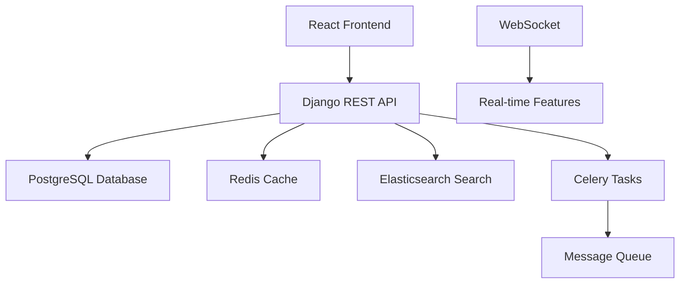

# 🚀 EngineerHub - 工程師的技術綠洲與創新工坊

<div align="center">

<!-- TODO: Replace with actual logo -->


**為工程師打造的知識共享、技術交流與作品展示的頂級社群平台**

[](https://python.org)
[](https://djangoproject.com)
[](https://reactjs.org)
[](https://typescriptlang.org)
[](LICENSE)

[🌟 功能亮點](#-功能亮點) • [🛠️ 技術架構](#️-技術架構) • [🚀 快速啟動](#-快速啟動) • [📚 專案文檔](#-專案文檔) • [🤝 如何貢獻](#-如何貢獻) • [🔮 未來藍圖](#-未來藍圖)

</div>

---

## 🎯 專案理念：連接思想，驅動創新

### 💡 核心願景

EngineerHub 致力於為全球工程師（初期聚焦中文地區，逐步拓展至全球）打造一個集**技術研討、知識傳播、經驗分享、作品展示**於一體的高質量社群。我們旨在：

-   🧠 **知識匯聚**：分享前沿技術、開發實踐與行業洞見。
-   🔥 **深度交流**：促進有價值的技術討論，共同攻克難題。
-   🌟 **品牌塑造**：展示個人技術作品與項目，建立專業影響力。
-   🤝 **人脈拓展**：連接志同道合的技術夥伴，擴展專業網絡。
-   📈 **職涯助力**：洞察行業趨勢，提升個人技術實力與市場競爭力。

### 🎨 設計哲學

-   **簡約直觀 (Simplicity First)**：打造清爽、專注內容的用戶界面，提供極致的閱讀與瀏覽體驗。
-   **效率至上 (Efficiency Focused)**：優化信息獲取流程，讓用戶快速定位所需內容。
-   **社群驅動 (Community Driven)**：以用戶生成內容 (UGC) 為核心，構建充滿活力的社群生態。
-   **技術前瞻 (Future Ready)**：擁抱最新技術趨勢，持續迭代，滿足未來發展需求。

### 🔮 未來展望：AI 時代的創新引擎

隨著 AI 輔助編程（Vibe Coding）的興起，程式設計的門檻正持續降低。我們預見，未來將有更多懷揣創意與想法的人才湧入，開發出各式各樣的應用與工具。EngineerHub 將不僅是工程師的技術交流平台，更將成為這些創新者展示作品、交流思想、激發靈感的重要樞紐，積極推動技術創新的普及化與民主化進程。

---

## 🌟 功能亮點：專為工程師打造的特色功能

### 🏠 智能首頁動態 (Intelligent Feed)
-   **個性化推薦**：借鑒 Threads 的滑動式瀏覽體驗，融合基於用戶行為（點讚、評論、瀏覽歷史、技能標籤）的深度學習算法，優先推送關注用戶的動態，其次是熱門內容及個性化推薦。
-   **即時追蹤**：不錯過任何關注者的重要更新。

### ✍️ 強大內容發佈 (Rich Content Creation)
-   **多元格式**：支持文字、鏈接、圖片（最多10張，可滑動瀏覽）、影片。
-   **🚀 程式碼分享 Pro**：
    -   **內嵌預覽區塊**：支持最多 100 行程式碼的即時預覽。
    -   **語法高亮**：Pygments 強力驅動，自動檢測並高亮超過 100 種程式語言。
    -   **點擊展開與滑動查看**：方便閱讀較長的程式碼片段。
    -   **一鍵複製**：提升程式碼分享與使用效率。
-   **發佈後編輯**：輕鬆修改文字內容，增刪媒體或程式碼。
-   **智能標籤**：輔助內容分類與發現。

### 🔍 高效智能搜索 (Advanced Search)
-   **用戶搜索**：快速查找並定位用戶，支持模糊匹配。
-   **內容檢索**：輸入關鍵字（如 "排序算法"），即可搜索相關貼文、討論及程式碼片段。
-   **近期搜索歷史**：方便快速回溯，支持一鍵清除。

### 💬 即時社交互動 (Real-time Interaction)
-   **基礎互動**：點讚、評論、轉發、分享、收藏貼文。
-   **用戶主頁訪問**：點擊頭像即可進入他人個人檔案。
-   **貼文詳情頁**：點擊貼文可進入獨立頁面，優化長文或多行程式碼的閱讀體驗。
-   **便捷操作**：貼文右上角 "More" 選單提供檢舉等操作。
-   **實時通知**：
    -   追蹤請求（含快速回追按鈕）。
    -   已發送的追蹤請求狀態（已發送/對方已接收）。
    -   點讚與評論提醒（附帶內容）。
-   **私信系統 (Direct Messaging)**：
    -   清晰的聊天列表與訊息預覽。
    -   訊息狀態（已讀/已傳送，附時間標記）。
    -   支持文字、表情符號、相簿圖片及影片。

### 👤 專業個人檔案 (Professional Profiles)
-   **個性化展示**：頭像、自定義簡介。
-   **技能標籤**：清晰展示技術專長（如 "Python", "AI", "前端開發"）。
-   **社交數據**：追蹤人數與被追蹤人數。
-   **快捷操作**：訪問自己檔案時顯示 "編輯個人檔案"，訪問他人檔案時顯示 "追蹤" 與 "發送訊息" 按鈕。
-   **作品集 Showcase**：
    -   支持圖片、影片展示。
    -   可附加 GitHub 倉庫鏈接。
    -   可鏈接到 Live Demo (如 Web App 網址)。
    -   可嵌入 YouTube 介紹影片。
-   **歷史貼文牆**：集中展示用戶發佈的所有內容。

### 🔐 安全便捷認證 (Secure Authentication)
-   **多種登入方式**：
    -   Google OAuth
    -   GitHub OAuth
    -   手機號碼/電子信箱 + 密碼
-   **簡化註冊**：僅需手機號碼/電子信箱、密碼、用戶名稱。
-   **安全保障**：採用 JWT 進行令牌認證，保護用戶數據安全。

### ⚙️ 便捷管理 (User Settings)
-   **帳戶設定**
-   **已儲存貼文查閱**
-   **安全登出**

---

## 🔮 未來藍圖：打造更完善的工程師生態

EngineerHub 的腳步不止於此，我們規劃了更激動人心的功能，旨在構建一個全方位的工程師社群生態：

### 🌟 近期規劃 (Coming Soon)
-   **✍️ Paper 模式 (Scholarly Articles)**：
    -   引入類似 Medium 的文章編輯與發佈模式，鼓勵資深工程師分享更具深度與學術性的技術長文。
-   **💎 會員增值服務 (Membership System)**：
    -   參考 Medium 模式，推出會員訂閱服務。
    -   免費會員可閱讀公開文章，付費會員可暢享獨家深度內容。
    -   建立內容激勵機制，讓優質文章（根據按讚數、觀看次數等指標）的創作者獲得收益，促進社群內高質量內容的持續產出。

### 🧠 AI 賦能進化 (AI-Powered Enhancements)
-   **智能推薦 Pro**：持續優化基於 AI 的內容推薦算法，提升個性化閱讀體驗。
-   **自動標籤建議**：利用機器學習輔助用戶為貼文生成更精準的標籤。
-   **程式碼智能分析**：提供基礎的程式碼質量、風格建議或潛在問題提示。

### 💬 高級互動與協作 (Advanced Interaction & Collaboration)
-   **群組聊天室 (Group Chats)**：針對特定技術主題或項目組建討論群組。
-   **技術直播 (Tech Live Streams)**：支持實時的技術分享、教學與演示。
-   **程式碼協作編輯 (Collaborative Code Editing)**：提供輕量級的在線程式碼片段協作功能。

### 🛠️ 專業工具集成 (Professional Toolkit)
-   **技術問答系統 (Q&A Platform)**：打造結構化的技術問答專區。
-   **代碼審查輔助 (Code Review Tools)**：集成或開發工具以輔助社群內部的代碼審查。

### 📱 移動端體驗 (Mobile Experience)
-   **React Native App**：開發跨平台的移動應用，優化移動端用戶體驗。
-   **推送通知強化**：更精準、更即時的移動端消息推送。
-   **離線功能支持**：部分核心功能的離線訪問。

### 🏢 企業級服務 (Enterprise Solutions)
-   **企業帳戶管理**
-   **內部團隊協作空間**
-   **技術招聘整合**

---

## 🛠️ 技術架構

### 🏗️ 整體架構



### 💻 前端技術棧

| 技術 | 版本 | 用途 |
|------|------|------|
| **React** | 18.0+ | 用戶界面框架 |
| **TypeScript** | 5.0+ | 類型安全的JavaScript |
| **Tailwind CSS** | 4.0+ | 原子化CSS框架 |
| **Zustand** | 4.5+ | 輕量級狀態管理 |
| **React Query** | 5.0+ | 伺服器狀態管理 |
| **React Router** | 6.0+ | 客戶端路由 |
| **Vite** | 6.0+ | 現代化構建工具 |
| **Headless UI** | 2.0+ | 無障礙UI組件 |

### 🔧 後端技術棧

| 技術 | 版本 | 用途 |
|------|------|------|
| **Django** | 4.2+ | Web框架核心 |
| **Django REST Framework** | 3.14+ | RESTful API開發 |
| **PostgreSQL** | 13+ | 主要數據庫 |
| **Redis** | 6.0+ | 緩存和會話存儲 |
| **Algolia** | - | 搜索引擎 |
| **Celery** | 5.3+ | 異步任務處理 |
| **Django Channels** | 4.0+ | WebSocket支援 |
| **Pygments** | 2.16+ | 程式碼語法高亮 |
| **JWT** | - | 無狀態認證 |

### 🏗️ 系統特性

-   **🔄 前後端分離**：獨立開發、部署和擴展
-   **📡 RESTful API**：統一的API設計規範
-   **⚡ 實時通信**：WebSocket支援即時功能
-   **🔍 全文搜索**：Elasticsearch強化搜索體驗
-   **📱 響應式設計**：完美適配各種設備
-   **🛡️ 安全防護**：多層次安全保障機制

---

## 🚀 快速啟動

我們提供了多種部署方式，無論您是想快速體驗還是深度參與開發，都能找到合適的方案。

### 📋 環境要求
-   **Node.js** >= 18.0
-   **Python** >= 3.9 (推薦 3.11)
-   **Docker Desktop** >= 4.0 (強烈推薦用於管理依賴服務)
-   **PostgreSQL** >= 13 (或使用 Docker)
-   **Redis** >= 6.0 (或使用 Docker)

### 🔧 推薦安裝方式：Docker 組合
這是最推薦的方式，能確保環境一致性並簡化依賴管理。

```bash
# 1. 克隆專案
git clone https://github.com/your-username/engineerhubweb.git # 請替換為您的倉庫地址
cd engineerhubweb

# 2. 啟動核心依賴服務 (PostgreSQL, Redis, Adminer)
docker-compose -f docker-compose.dev.yml up -d postgres redis adminer

# 3. 後端設置與啟動 (詳見 SETUP_GUIDE.md)
#    - 創建並配置 backend/.env
#    - 執行資料庫遷移: docker-compose -f docker-compose.dev.yml run --rm django python manage.py migrate
#    - 創建超級用戶: docker-compose -f docker-compose.dev.yml run --rm django python manage.py createsuperuser
#    - 啟動後端開發伺服器 (本地或 Docker)

# 4. 前端設置與啟動 (詳見 SETUP_GUIDE.md)
#    - cd frontend
#    - npm install
#    - 創建並配置 frontend/.env.local
#    - npm run dev
```

👉 **獲取完整分步指南，請參閱：[📋 完整安裝設置指南 (SETUP_GUIDE.md)](SETUP_GUIDE.md)**

該指南包含了更詳細的環境準備、API 金鑰獲取、多種部署方式（包括純本地部署和完全 Docker 化部署）、故障排除等內容。

### 🌐 訪問應用
-   **前端應用**：http://localhost:5173 (或其他您配置的端口)
-   **後端API**：http://localhost:8000
-   **API文檔**：http://localhost:8000/api/docs/
-   **管理後台**：http://localhost:8000/admin/
-   **資料庫管理 (Adminer)**：http://localhost:8080 (使用 Docker 方式時可用)

---

## 📚 專案文檔

為了幫助您更好地理解和參與 EngineerHub，我們準備了詳盡的文檔：

-   🚀 [**完整安裝設置指南 (SETUP_GUIDE.md)**](SETUP_GUIDE.md)：從零開始到本地運行的完整步驟。
-   🧭 [**專案總導覽 (PROJECT_GUIDE.md)**](PROJECT_GUIDE.md)：深入了解專案架構、模塊設計和開發理念。
-   🎨 [**前端開發指南 (frontend/FRONTEND_GUIDE.md)**](frontend/FRONTEND_GUIDE.md)：React 前端開發的詳細說明。
-   🔧 [**後端開發指南 (backend/BACKEND_GUIDE.md)**](backend/BACKEND_GUIDE.md)：Django 後端開發的詳細說明。
-   🔌 [**API 接口文檔 (Swagger UI)**](http://localhost:8000/api/docs/)：實時更新的後端 API 接口文檔（需後端服務運行）。

---

## 🤝 如何貢獻

EngineerHub 是一個開源專案，我們熱烈歡迎來自社群的任何形式的貢獻！無論是程式碼、文檔、測試還是創意想法，都對我們至關重要。

### 🛠️ 貢獻流程
1.  **Fork** 本專案。
2.  創建您的特性分支 (`git checkout -b feature/YourAmazingFeature`)。
3.  提交您的更改 (`git commit -m 'feat: Add some AmazingFeature'`) - 請遵循 [Conventional Commits](https://www.conventionalcommits.org/) 規範。
4.  將您的分支推送到 Fork 的倉庫 (`git push origin feature/YourAmazingFeature`)。
5.  創建一個清晰描述您工作的 **Pull Request**。

### 📋 貢獻類型
-   🐛 **Bug 修復**：發現並修復程式中的錯誤。
-   ✨ **新功能開發**：實現新的特性或模塊。
-   📝 **文檔完善**：改進、補充或翻譯專案文檔。
-   🎨 **UI/UX 優化**：提升用戶界面的美觀性與易用性。
-   ⚡ **性能提升**：優化程式碼執行效率或資源利用。
-   🧪 **測試增強**：編寫單元測試、集成測試或端到端測試。

### 📐 開發規範
-   **程式碼風格**：前端遵循 ESLint，後端遵循 Black 和 Flake8。
-   **提交信息**：遵循 Conventional Commits 格式。
-   **測試覆蓋**：新功能和重要修復應包含相應的測試用例。
-   **文檔同步**：對功能或 API 的更改需及時更新相關文檔。

🌟 **期待您的加入，與我們一同打造更卓越的 EngineerHub！**

---

## 📄 授權協議 (License)

本專案採用 [MIT 授權協議](LICENSE)。您可以自由地使用、複製、修改、合併、出版發行、散布、再授權及販售軟體及軟體的副本。

---

## 🙏 特別致謝 (Acknowledgements)

EngineerHub 的誕生離不開以下優秀的開源專案和社群的支持，在此表示衷心的感謝：

-   [Django](https://djangoproject.com) - 強大穩健的 Python Web 框架。
-   [React](https://reactjs.org) - 高效靈活的前端 UI 框架。
-   [PostgreSQL](https://postgresql.org) - 功能豐富的開源對象關係型數據庫。
-   [Elasticsearch](https://elastic.co) - 分佈式搜索和分析引擎。
-   [Tailwind CSS](https://tailwindcss.com) - 實用優先的 CSS 框架。
-   以及所有我們使用到的開源庫和工具的貢獻者們！

---

## 📞 聯繫我們 (Contact Us)

如果您有任何問題、建議或合作意向，歡迎通過以下方式聯繫我們：

-   **問題回報 (Bug Reports)**：[GitHub Issues](https://github.com/your-username/engineerhubweb/issues)
-   **功能建議 (Feature Requests)**：[GitHub Discussions](https://github.com/your-username/engineerhubweb/discussions)
-   **技術支持郵箱**：[support@engineerhub.dev](mailto:support@engineerhub.dev) (假設郵箱)
-   **商務合作郵箱**：[business@engineerhub.dev](mailto:business@engineerhub.dev) (假設郵箱)

---

<div align="center">

**⭐ 如果您喜歡 EngineerHub，請不吝給我們一個 Star！您的支持是我們前進的最大動力！ ⭐**

<br>

**EngineerHub Team & Contributors | Made with ❤️ and ☕**

</div> 