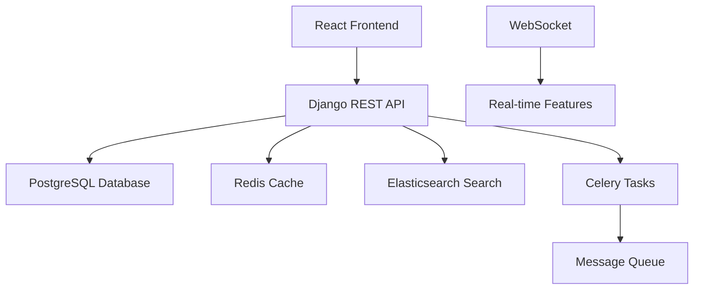

# 🚀 EngineerHub - 工程師專屬技術社群平台

<div align="center">


**打造屬於工程師的技術討論社群**

[](https://python.org)
[](https://djangoproject.com)
[](https://reactjs.org)
[](https://typescriptlang.org)
[](LICENSE)

[🌟 功能特色](#-功能特色) • [🛠️ 技術架構](#️-技術架構) • [🚀 快速開始](#-快速開始) • [📖 文檔](#-文檔) • [🤝 貢獻](#-貢獻)

</div>

---

## 🎯 專案理念

### 💡 願景使命

EngineerHub 致力於打造一個專屬於工程師的高品質技術討論社群，讓全球工程師能夠：

- 🧠 **知識分享**：分享最新技術知識、開發經驗和最佳實踐
- 🔥 **技術討論**：參與深度的技術討論和問題解決
- 🌟 **作品展示**：展示個人技術作品，建立專業品牌
- 🤝 **社群連結**：與志同道合的技術人才建立連結
- 📈 **職涯發展**：獲取行業趨勢，提升技術能力

### 🎨 設計哲學

- **簡約至上**：乾淨直觀的UI設計，讓用戶專注於內容
- **效率優先**：快速的內容瀏覽和資訊獲取體驗
- **社群驅動**：以用戶生成內容為核心的社群生態
- **技術前瞻**：擁抱最新技術趨勢，支援未來發展

### 🔮 未來展望

隨著 AI 輔助編程的普及，我們相信程式設計的門檻將持續降低，更多具有創意想法的人將能夠開發自己的應用和工具。EngineerHub 將成為這些創新者展示作品、交流想法的重要平台，推動技術創新的民主化進程。

---

## 🌟 功能特色

### 🏠 智能首頁動態

- **個人化推薦**：基於AI演算法的內容推薦系統
- **追蹤動態**：即時獲取關注用戶的最新動態
- **熱門內容**：發現社群中的熱門技術討論
- **滑動體驗**：流暢的滑動式內容瀏覽

### ✍️ 豐富內容發佈

- **多媒體支援**：文字、圖片、影片一鍵發佈
- **程式碼分享**：
  - 🎨 語法高亮顯示（支援100+程式語言）
  - 🔍 自動語言檢測（基於Pygments）
  - 📋 一鍵複製程式碼
  - 📏 100行內程式碼預覽
- **即時編輯**：發佈後可編輯內容、新增或刪除媒體
- **標籤系統**：智能標籤推薦和分類

### 🔍 強大搜索引擎

- **全文搜索**：基於Elasticsearch的高效搜索
- **智能建議**：用戶名稱自動補全
- **內容檢索**：關鍵字搜索相關貼文和程式碼
- **搜索歷史**：便捷的近期搜索記錄

### 💬 即時社交互動

- **實時聊天**：基於WebSocket的即時通訊
- **多樣互動**：點讚、留言、轉發、收藏
- **智能通知**：即時推送互動消息
- **關注系統**：建立專業的技術人脈網路

### 👤 專業個人檔案

- **完整資料**：展示技術技能、工作經驗
- **作品集展示**：
  - 🖼️ 多媒體作品展示
  - 🔗 GitHub專案連結
  - 🌐 Live Demo展示
  - 📺 YouTube介紹影片
- **技能標籤**：專業技能可視化展示
- **聲譽系統**：基於社群貢獻的聲譽積分

### 🔐 安全認證系統

- **多元登入**：
  - 📧 Email/手機號碼註冊
  - 🔗 Google OAuth登入
  - 👨‍💻 GitHub整合登入
- **安全保障**：JWT令牌認證、資料加密保護

---

## 🛠️ 技術架構

### 🏗️ 整體架構



### 💻 前端技術棧

| 技術 | 版本 | 用途 |
|------|------|------|
| **React** | 18.0+ | 用戶界面框架 |
| **TypeScript** | 5.0+ | 類型安全的JavaScript |
| **Tailwind CSS** | 4.0+ | 原子化CSS框架 |
| **Zustand** | 4.5+ | 輕量級狀態管理 |
| **React Query** | 5.0+ | 伺服器狀態管理 |
| **React Router** | 6.0+ | 客戶端路由 |
| **Vite** | 6.0+ | 現代化構建工具 |
| **Headless UI** | 2.0+ | 無障礙UI組件 |

### 🔧 後端技術棧

| 技術 | 版本 | 用途 |
|------|------|------|
| **Django** | 4.2+ | Web框架核心 |
| **Django REST Framework** | 3.14+ | RESTful API開發 |
| **PostgreSQL** | 13+ | 主要數據庫 |
| **Redis** | 6.0+ | 緩存和會話存儲 |
| **Elasticsearch** | 8.0+ | 搜索引擎 |
| **Celery** | 5.3+ | 異步任務處理 |
| **Django Channels** | 4.0+ | WebSocket支援 |
| **Pygments** | 2.16+ | 程式碼語法高亮 |
| **JWT** | - | 無狀態認證 |

### 🏗️ 系統特性

- **🔄 前後端分離**：獨立開發、部署和擴展
- **📡 RESTful API**：統一的API設計規範
- **⚡ 實時通信**：WebSocket支援即時功能
- **🔍 全文搜索**：Elasticsearch強化搜索體驗
- **📱 響應式設計**：完美適配各種設備
- **🛡️ 安全防護**：多層次安全保障機制

---

## 🚀 快速開始

### 📋 環境要求

- **Node.js** >= 18.0
- **Python** >= 3.9
- **Docker Desktop** >= 4.0 (推薦)
- **PostgreSQL** >= 13 (或使用 Docker)
- **Redis** >= 6.0 (或使用 Docker)

### 🔧 安裝步驟

> **⚠️ Windows Git Bash 用戶注意**
> 
> 如果您使用 **Windows Git Bash**，建議使用 **Docker 方式**或切換到 **PowerShell/CMD**，
> 以避免與某些 Python 包的兼容性問題。

#### 方式一：Docker 部署（推薦）

```bash
# 1. 克隆專案
git clone https://github.com/your-username/engineerhubweb.git
cd engineerhubweb

# 2. 啟動資料庫服務
docker-compose -f docker-compose.dev.yml up -d postgres redis

# 3. 後端設置（使用 Docker）
# 複製環境變數範本
cp backend/env_example.txt backend/.env
# 編輯 backend/.env 文件，設置必要的配置

# 執行資料庫遷移
docker-compose -f docker-compose.dev.yml run --rm django python manage.py migrate

# 創建超級用戶
docker-compose -f docker-compose.dev.yml run --rm django python manage.py createsuperuser

# 4. 前端設置
cd frontend
npm install

# 5. 啟動服務
# 啟動後端（使用 Docker）
docker-compose -f docker-compose.dev.yml up django

# 啟動前端（在新終端）
cd frontend && npm run dev
```

#### 方式二：本地環境部署

> **適用於 PowerShell、CMD 或 Linux/macOS 終端**

```bash
# 1. 克隆專案
git clone https://github.com/your-username/engineerhubweb.git
cd engineerhubweb

# 2. 啟動資料庫服務（使用 Docker）
docker-compose -f docker-compose.dev.yml up -d postgres redis

# 3. 後端設置
cd backend

# 創建虛擬環境
conda create -n engineerhubweb python=3.11
conda activate engineerhubweb

# 安裝依賴
pip install -r requirements.txt

# 環境變量配置
cp env_example.txt .env
# 編輯 .env 文件，設置數據庫連接等配置

# 數據庫遷移
python manage.py migrate

# 創建超級用戶
python manage.py createsuperuser

# 啟動後端服務
python manage.py runserver

# 4. 前端設置（新開終端）
cd frontend
npm install
npm run dev
```

#### 方式三：完全 Docker 部署

```bash
# 克隆專案
git clone https://github.com/your-username/engineerhubweb.git
cd engineerhubweb

# 一鍵啟動所有服務
docker-compose -f docker-compose.dev.yml up

# 前端需要單獨啟動（在新終端）
cd frontend
npm install
npm run dev
```

### 🌐 訪問應用

完成安裝後，您可以訪問以下地址：

- **前端應用**：http://localhost:5173
- **後端API**：http://localhost:8000
- **API文檔**：http://localhost:8000/api/docs/
- **管理後台**：http://localhost:8000/admin/ （用戶名：admin，密碼：admin123）
- **資料庫管理**：http://localhost:8080 (Adminer，僅 Docker 方式)

### 🔧 常用 Docker 命令

```bash
# 查看服務狀態
docker-compose -f docker-compose.dev.yml ps

# 查看日誌
docker-compose -f docker-compose.dev.yml logs django

# 停止服務
docker-compose -f docker-compose.dev.yml down

# 重新啟動
docker-compose -f docker-compose.dev.yml restart

# 執行 Django 管理命令
docker-compose -f docker-compose.dev.yml run --rm django python manage.py <command>
```

### 📖 詳細安裝指南

如需更詳細的安裝說明和故障排除，請參考：
- 📋 [**完整安裝設置指南**](SETUP_GUIDE.md) - 包含詳細步驟和問題解決方案

---

## 🎯 已實現功能

### ✅ 核心功能

- [✅] **用戶認證系統**
  - [✅] 註冊/登入/登出
  - [✅] JWT令牌認證
  - [✅] 第三方登入（Google, GitHub）
  - [✅] 密碼重置功能

- [✅] **內容管理系統**
  - [✅] 貼文發佈和編輯
  - [✅] 圖片和影片上傳
  - [✅] 程式碼語法高亮
  - [✅] 標籤系統

- [✅] **社交互動功能**
  - [✅] 點讚、留言、轉發
  - [✅] 關注/取消關注用戶
  - [✅] 實時通知推送
  - [✅] 私訊聊天系統

- [✅] **搜索和發現**
  - [✅] 全文搜索功能
  - [✅] 用戶搜索
  - [✅] 熱門內容推薦
  - [✅] 探索頁面

- [✅] **個人檔案管理**
  - [✅] 完整的個人資料
  - [✅] 技能標籤管理
  - [✅] 作品集展示
  - [✅] 聲譽積分系統

### 🚧 開發中功能

- [ ] **AI增強功能**
  - [ ] 智能內容推薦演算法
  - [ ] 自動標籤生成
  - [ ] 程式碼智能分析

- [ ] **高級互動功能**
  - [ ] 群組聊天室
  - [ ] 技術直播功能
  - [ ] 程式碼協作編輯

- [ ] **專業工具**
  - [ ] 技術問答系統
  - [ ] 代碼審查工具
  - [ ] 技術文章發佈

### 📅 未來規劃

- [ ] **移動應用**
  - [ ] React Native移動端
  - [ ] 推送通知優化
  - [ ] 離線功能支援

- [ ] **企業功能**
  - [ ] 企業帳戶管理
  - [ ] 團隊協作工具
  - [ ] 招聘整合功能

---

## 📖 文檔

### 📚 開發文檔

- 📋 [**專案總導覽**](PROJECT_GUIDE.md) - 完整的專案架構和學習指南
- 🎨 [**前端開發指南**](frontend/FRONTEND_GUIDE.md) - React前端開發詳解
- 🔧 [**後端開發指南**](backend/BACKEND_GUIDE.md) - Django後端開發詳解
- 🔌 [**API文檔**](http://localhost:8000/api/docs/) - 自動生成的API文檔

### 🎓 學習資源

- [React官方文檔](https://react.dev)
- [Django官方文檔](https://docs.djangoproject.com)
- [TypeScript官方文檔](https://www.typescriptlang.org)
- [Tailwind CSS文檔](https://tailwindcss.com)

---

## 🧪 測試

### 前端測試

```bash
cd frontend
npm run test          # 運行單元測試
npm run test:coverage # 測試覆蓋率報告
npm run test:e2e      # 端到端測試
```

### 後端測試

```bash
cd backend
python manage.py test           # 運行所有測試
python manage.py test --coverage # 測試覆蓋率
pytest                          # 使用pytest運行測試
```

---

## 🚀 部署

### 📦 生產環境部署

```bash
# 前端構建
cd frontend
npm run build

# 後端部署
cd backend
python manage.py collectstatic
gunicorn engineerhub.wsgi:application
```

### ☁️ 雲端部署

支援部署到以下平台：

- **Heroku**：一鍵部署配置
- **AWS**：完整的雲端解決方案
- **Digital Ocean**：經濟實惠的選擇
- **Google Cloud**：高效能雲端運算

---

## 🤝 貢獻

我們歡迎所有形式的貢獻！

### 🛠️ 開發貢獻

1. **Fork** 專案
2. 創建功能分支 (`git checkout -b feature/amazing-feature`)
3. 提交更改 (`git commit -m 'Add amazing feature'`)
4. 推送分支 (`git push origin feature/amazing-feature`)
5. 創建 **Pull Request**

### 📋 貢獻類型

- 🐛 **Bug修復**：發現並修復問題
- ✨ **新功能**：實現新的功能特性
- 📝 **文檔改進**：完善文檔和註釋
- 🎨 **UI/UX優化**：改進用戶界面體驗
- ⚡ **效能優化**：提升系統效能
- 🧪 **測試增強**：添加或改進測試

### 📐 開發規範

- **代碼風格**：遵循ESLint和Black格式化規範
- **提交規範**：使用Conventional Commits格式
- **測試要求**：新功能必須包含相應測試
- **文檔更新**：功能變更需同步更新文檔

---

## 📄 授權協議

本專案採用 [MIT 授權協議](LICENSE)。您可以自由使用、修改和分發本軟體。

---

## 🙏 致謝

感謝以下開源專案和社群的支持：

- [Django](https://djangoproject.com) - 強大的Python Web框架
- [React](https://reactjs.org) - 優秀的前端UI框架
- [PostgreSQL](https://postgresql.org) - 可靠的開源數據庫
- [Elasticsearch](https://elastic.co) - 強大的搜索引擎
- [Tailwind CSS](https://tailwindcss.com) - 現代化的CSS框架

---

## 📞 聯繫我們

- **問題回報**：[GitHub Issues](https://github.com/your-username/engineerhubweb/issues)
- **功能建議**：[GitHub Discussions](https://github.com/your-username/engineerhubweb/discussions)
- **技術支援**：[support@engineerhub.dev](mailto:support@engineerhub.dev)
- **商務合作**：[business@engineerhub.dev](mailto:business@engineerhub.dev)

---

<div align="center">

**⭐ 如果您喜歡這個專案，請給我們一個星星！ ⭐**

Made with ❤️ by the EngineerHub Team

</div> 